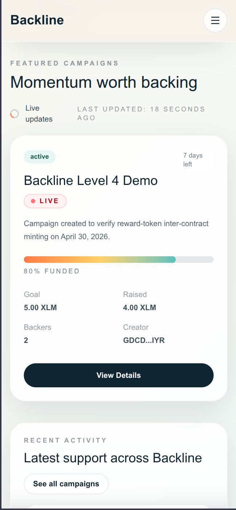
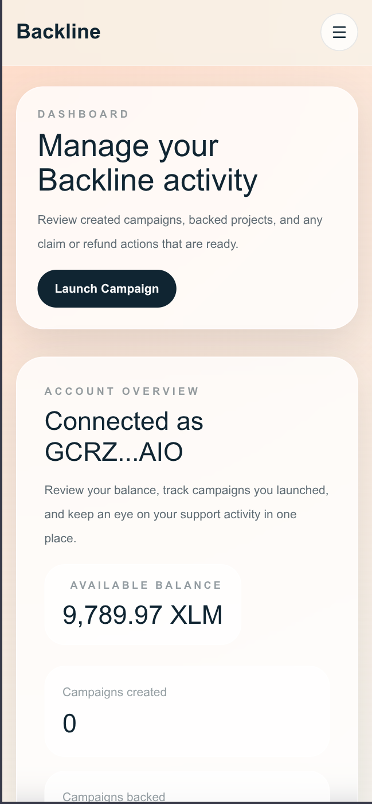
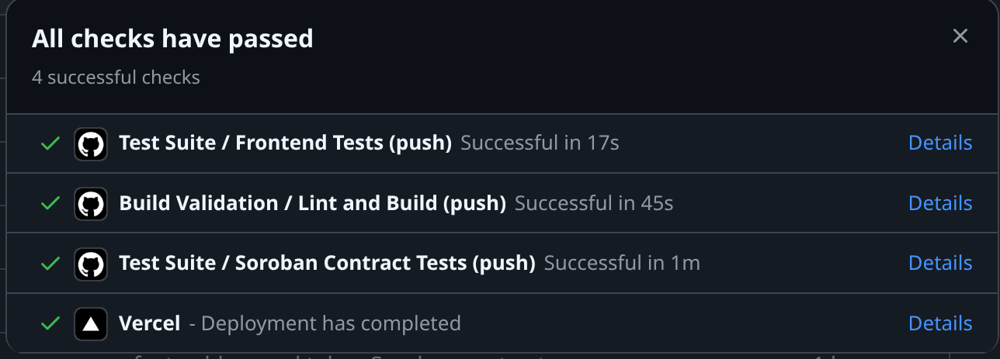

# Backline


Backline is a crowdfunding platform built on Stellar with a Next.js frontend and a Soroban smart contract. Creators can launch campaigns with funding goals and deadlines, supporters can back them with XLM, and campaigns follow clear claim and refund rules after the deadline.

## Content

- [Overview](#overview)
- [Level 4 completion](#level-4-completion)
- [Highlights](#highlights)
- [Live links](#live-links)
- [Live contract details](#live-contract-details)
- [Screenshots](#screenshots)
- [Features](#features)
- [Tech stack](#tech-stack)
- [Project structure](#project-structure)
- [Reward token system](#reward-token-system)
- [CI/CD pipeline](#cicd-pipeline)
- [Test status](#test-status)
- [Getting started](#getting-started)
- [Smart contract workflow](#smart-contract-workflow)
- [Product behavior](#product-behavior)

## Overview

- Product: `Backline`
- Category: crowdfunding dApp
- Network used today: Stellar testnet
- Frontend: Next.js, React, TypeScript, Tailwind CSS
- Smart contract: Soroban Rust contract
- Wallet support: Freighter

## Level 4 completion

Backline now satisfies the core Level 4 requirements:

- Inter-contract calls for automatic BLR reward minting
- Custom reward token deployed on Stellar testnet
- Real-time contract event streaming in the frontend
- GitHub Actions CI/CD workflow for validation and deployment
- Mobile-responsive navigation, forms, and campaign layouts
- Production-focused retry logic, skeleton states, and SEO polish

## Highlights

- Campaign creation with title, description, goal, and deadline
- Campaign browsing with filtering, sorting, progress tracking, and status grouping
- Campaign details with live backing, claim, and refund actions
- Inter-contract BLR reward token minting on successful backing
- Real-time contract event streaming for live UI refresh
- Mobile-responsive navigation and touch-friendly campaign flows
- GitHub Actions CI/CD pipeline for test and deploy automation
- Freighter wallet connection and transaction signing
- Cached campaign and balance reads with React Query
- Toast-based transaction feedback for pending, success, and error states
- Creator dashboard with account-specific campaign activity
- Real Soroban contract deployment and live contract reads

## Live links

- Live website: [backline-web.vercel.app](https://backline-web.vercel.app)

- Demo video: [Watch on Youtube](https://youtu.be/jTLjVX4klvo)

## Live contract details

- Contract ID:
  [CD3FVQNCYZW3WCHVQK2QFTDUX7SUP5RYPY2O5O5C375R3O466ZXWB4HX](https://stellar.expert/explorer/testnet/contract/CD3FVQNCYZW3WCHVQK2QFTDUX7SUP5RYPY2O5O5C375R3O466ZXWB4HX)

- Upgraded Level 4 Contract ID:
  [CDFNRRO337HJY6VCJQWCOM2ATHEPMTZ3I7KK4HCWA5TEOWEZZG37HFMP](https://stellar.expert/explorer/testnet/contract/CDFNRRO337HJY6VCJQWCOM2ATHEPMTZ3I7KK4HCWA5TEOWEZZG37HFMP)


- Deploy transaction on Stellar Expert:
  [9982e8c1eb88ce2daa650ef091a2c50cd6fbcd016d0cabbaed7e9f13b47c4cee](https://stellar.expert/explorer/testnet/tx/9982e8c1eb88ce2daa650ef091a2c50cd6fbcd016d0cabbaed7e9f13b47c4cee)

- Reward Token Contract ID:
  [CDH7RDPLWMQZM47SANN2ZF2MBFVMVG7MGWYAUJID2OI4TQYVH3CDPFDT](https://stellar.expert/explorer/testnet/contract/CDH7RDPLWMQZM47SANN2ZF2MBFVMVG7MGWYAUJID2OI4TQYVH3CDPFDT)

- Reward Token Deploy Transaction:
  [9ba9b3c68f6c7652dd167613bd0cb61b2facda941116a679d54f79c776fe311b](https://stellar.expert/explorer/testnet/tx/9ba9b3c68f6c7652dd167613bd0cb61b2facda941116a679d54f79c776fe311b)

- Real Inter-Contract Backing Transaction:
  [915da303080fdd226ebc4b309019f01184d895bd68028678c1ac751e446c9f65](https://stellar.expert/explorer/testnet/tx/915da303080fdd226ebc4b309019f01184d895bd68028678c1ac751e446c9f65)


- Verified reward outcome:
  backing `2 XLM` minted `20 BLR` to the backer wallet on testnet

### Contract methods

- `get_campaign_count`
- `initialize_admin`
- `create_campaign`
- `set_reward_token`
- `get_reward_token`
- `back_campaign`
- `get_campaign`
- `get_total_raised`
- `get_backers_count`
- `get_backers`
- `claim_funds`
- `refund`

## Screenshots

### Hero Section
<table>
  <tr>
    <td align="center" width="50%">
      <strong>Hero Section</strong><br />
      
    </td>
    <td align="center" width="50%">
      <strong>Campaign Listing</strong><br />
      
    </td>
  </tr>
  <tr>
    <td align="center" width="50%">
      <strong>Detailed Campaign Page</strong><br />
      
    </td>
    <td align="center" width="50%">
      <strong>Dashboard</strong><br />
      
    </td>
  </tr>
  <tr>
    <td align="center" width="50%">
      <strong>Create Campaign</strong><br />
      
    </td>
    <td align="center" width="50%"></td>
  </tr>
</table>


### Mobile screenshots
<table>
  <tr>
    <td align="center" width="50%">
      <strong>Mobile Home</strong><br />
      
    </td>
    <td align="center" width="50%">
      <strong>Mobile Dashboard</strong><br />
      
    </td>
  </tr>
</table>

### Test Cases Passed(3)


### CI/CD 


## Features

### Core product

- Home page focused on product marketing and featured campaigns
- Campaign listing page with active campaigns prioritized ahead of ended ones
- Campaign detail page with recent backers, contribution form, and campaign actions
- Creator dashboard with created campaigns, backed campaigns, claim queue, and refund queue
- Create campaign page with preview and draft persistence

### Wallet and transaction flow

- Freighter wallet connect and disconnect flow
- Signed Soroban transactions for:
  - `create_campaign`
  - `back_campaign`
  - `claim_funds`
  - `refund`
- Transaction hash feedback with Stellar Expert links
- Friendly toast errors for cancellation, missing wallet, and submission failures

### Contract-backed data

- Campaign list loaded from live contract storage
- Individual campaign details loaded from the deployed contract
- Backer counts and recent contribution data loaded from contract reads
- Polling-based refresh through React Query
- Reward token balances loaded from the deployed BLR token contract

### Level 4 additions

- Custom BLR reward token contract deployed on Stellar testnet
- Inter-contract call from crowdfund contract to reward token contract
- Real backing transaction verified with on-chain reward mint event
- Real-time event streaming with live campaign refresh
- Mobile-responsive navigation and campaign interaction layouts
- CI/CD workflow for typecheck, frontend tests, contract tests, and build

## Tech stack

### Frontend

- Next.js `16.2.4`
- React `19.2.5`
- TypeScript `6.0.3`
- Tailwind CSS `4.2.4`
- `@tanstack/react-query`
- `@stellar/stellar-sdk`
- `@stellar/freighter-api`
- `sonner`
- `lucide-react`

### Smart contract

- Rust
- `soroban-sdk`
- Crowdfund contract
- Reward token contract

### Testing

- Vitest
- Testing Library
- Soroban contract unit tests

## Project structure

```text
.
├── contracts/
│   └── crowdfund/
│       ├── src/
│       └── Cargo.toml
├── src/
│   ├── app/
│   ├── components/
│   ├── hooks/
│   ├── lib/
│   ├── tests/
│   └── types/
├── .env.example
├── package.json
└── README.md
```

## Reward token system

Backline rewards supporters with `BLR` whenever they back a campaign on the upgraded crowdfund contract.

- Reward token: `Backline Reward`
- Symbol: `BLR`
- Decimals: `7`
- Reward ratio: `10 BLR` per `1 XLM`
- Live verified example: backing `2 XLM` minted `20 BLR`

Flow:

1. Backer calls `back_campaign` on the upgraded crowdfund contract
2. Crowdfund contract updates campaign totals and contribution records
3. Crowdfund contract performs an inter-contract call into the BLR token contract
4. BLR is minted directly to the backer wallet
5. Frontend refreshes campaign data and reward balances

## CI/CD pipeline

Backline now uses three separate GitHub Actions workflows:

- `Build Validation` -> `.github/workflows/ci-cd.yml`
- `Test Suite` -> `.github/workflows/tests.yml`
- `Vercel Deploy` -> `.github/workflows/deploy.yml`

Workflow responsibilities:

1. `Build Validation`
   - installs dependencies
   - runs TypeScript validation
   - runs the production Next.js build
2. `Test Suite`
   - runs frontend Vitest test cases
   - runs crowdfund contract tests
   - runs reward token contract tests
3. `Vercel Deploy`
   - pulls project settings from Vercel
   - runs `vercel build`
   - runs `vercel deploy --prebuilt`

Trigger behavior:

- `Build Validation`: push to `main` and `develop`, pull requests to `main` and `develop`, manual dispatch
- `Test Suite`: push to `main` and `develop`, pull requests to `main` and `develop`, manual dispatch
- `Vercel Deploy`: manual dispatch or automatic run after `Build Validation` succeeds on `main`

Required GitHub repository secrets:

- `CONTRACT_ID`
- `REWARD_TOKEN_ID`
- `VERCEL_TOKEN`
- `VERCEL_ORG_ID`
- `VERCEL_PROJECT_ID`

Recommended live values for the current Level 4 deployment:

- `CONTRACT_ID=CDFNRRO337HJY6VCJQWCOM2ATHEPMTZ3I7KK4HCWA5TEOWEZZG37HFMP`
- `REWARD_TOKEN_ID=CDH7RDPLWMQZM47SANN2ZF2MBFVMVG7MGWYAUJID2OI4TQYVH3CDPFDT`


## Test status

Verified locally:

```bash
$ pnpm test

Test Files  3 passed (3)
Tests       3 passed (3)
```

Covered flows:

- Wallet connect and disconnect flow
- Campaign data fetching
- Backing transaction mutation flow
- Crowdfund contract logic and reward-token mint integration

Additional verified commands:

```bash
pnpm exec tsc --noEmit
pnpm build
cargo test --manifest-path contracts/crowdfund/Cargo.toml
cargo test --manifest-path contracts/reward-token/Cargo.toml
```

## Getting started

### Prerequisites

- Node.js `18+`
- `pnpm`
- Rust toolchain
- `wasm32v1-none` target
- Freighter browser extension

### Install

```bash
pnpm install
```

### Vercel setup

1. Open the Vercel dashboard and create/import the project
2. Go to `Project Settings -> General`
3. Copy:
   - `Project ID` -> `VERCEL_PROJECT_ID`
   - `Team ID` or account/team identifier -> `VERCEL_ORG_ID`
4. Go to `Vercel Dashboard -> Settings -> Tokens`
5. Create a token and use it as `VERCEL_TOKEN`
6. Add the required GitHub Actions secrets listed above
7. Set the same environment variables in the Vercel project dashboard for production deployments

### Environment variables

Copy `.env.example` to `.env.local`:

```bash
NEXT_PUBLIC_NETWORK=testnet
NEXT_PUBLIC_CONTRACT_ID=CDFNRRO337HJY6VCJQWCOM2ATHEPMTZ3I7KK4HCWA5TEOWEZZG37HFMP
NEXT_PUBLIC_REWARD_TOKEN_ID=CDH7RDPLWMQZM47SANN2ZF2MBFVMVG7MGWYAUJID2OI4TQYVH3CDPFDT
NEXT_PUBLIC_SOROBAN_RPC_URL=https://soroban-testnet.stellar.org
NEXT_PUBLIC_HORIZON_URL=https://horizon-testnet.stellar.org
NEXT_PUBLIC_STELLAR_EXPERT_URL=https://stellar.expert/explorer/testnet
```

### Run the app

```bash
pnpm dev
```

### Run frontend tests

```bash
pnpm test
```

### Type check

```bash
pnpm exec tsc --noEmit
```

## Smart contract workflow

### Run contract tests

```bash
pnpm contract:test
pnpm contract:test:reward
```

### Build the contract

```bash
pnpm contract:build
pnpm contract:build:reward
```

### Manual deploy command

```bash
stellar contract deploy \
  --wasm target/wasm32v1-none/release/backline_crowdfund.wasm \
  --source-account earnify-admin \
  --network testnet \
  --alias backline-testnet
```

### Reward token deployment used for Level 4

```bash
stellar contract deploy \
  --wasm target/wasm32v1-none/release/reward_token.wasm \
  --source-account earnify-admin \
  --network testnet \
  --alias backline-reward-token-v2
```

### Inter-contract verification

The following live transaction demonstrates the upgraded crowdfund contract calling the reward token contract during `back_campaign`:

`https://stellar.expert/explorer/testnet/tx/915da303080fdd226ebc4b309019f01184d895bd68028678c1ac751e446c9f65`

This transaction shows both events:

- `campaign_backed` from the upgraded crowdfund contract
- `reward_minted` from the BLR token contract

## Product behavior

### Campaign lifecycle

1. A creator launches a campaign with a goal and deadline.
2. Backers contribute XLM by signing Soroban transactions with Freighter.
3. Active campaigns stay visible first in campaign listings.
4. If a campaign reaches its goal and the deadline passes, the creator can claim funds.
5. If a campaign misses its goal and the deadline passes, backers can request refunds.

### Data and caching

- Campaign data uses React Query caching
- Balance reads are cached and refreshed after mutations
- Campaign detail reads are refetched on an interval for near-live updates
