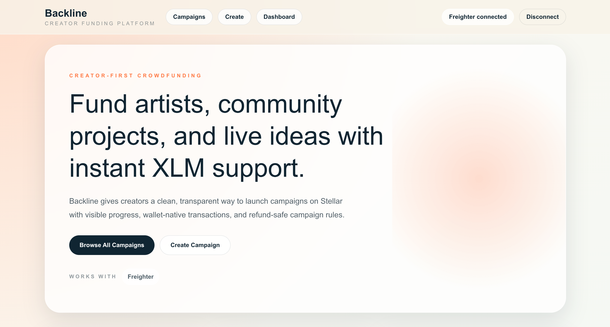
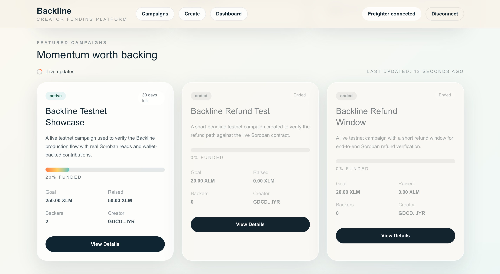
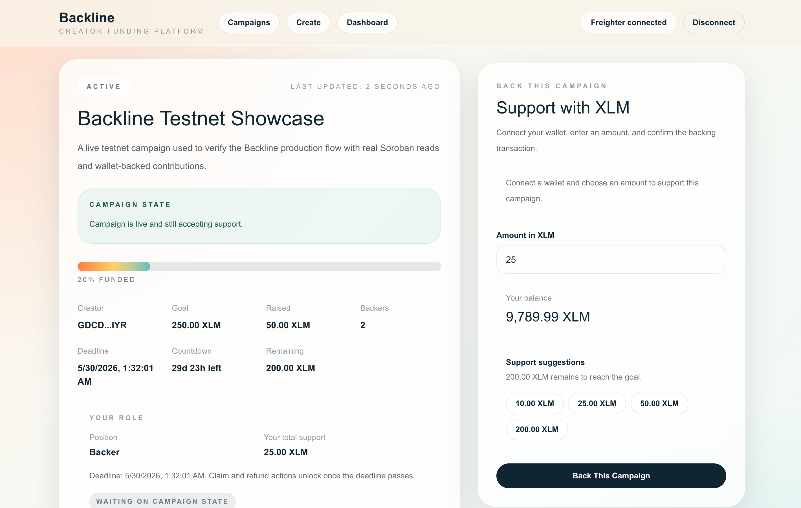
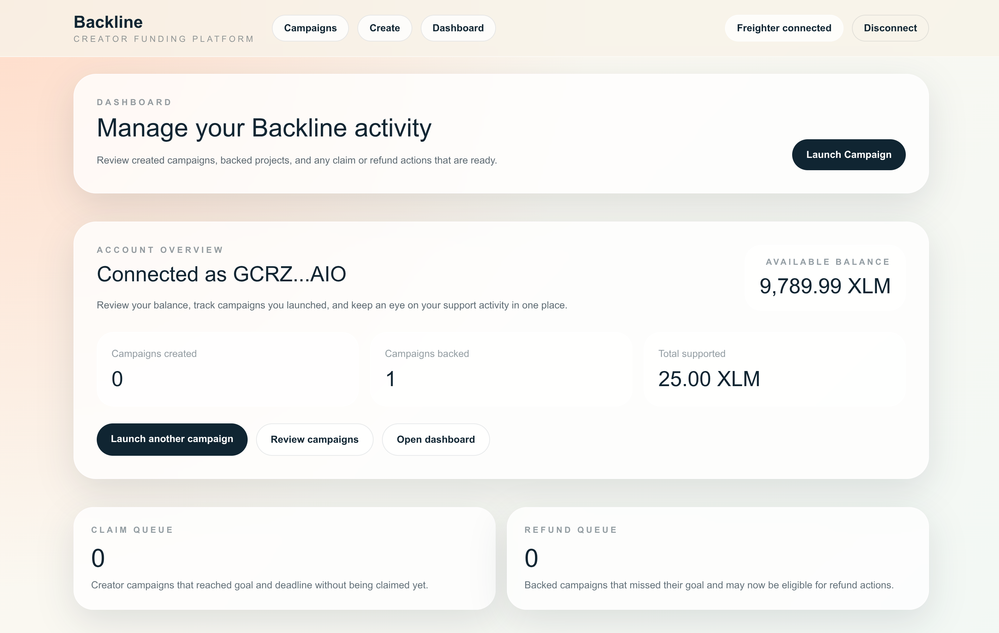
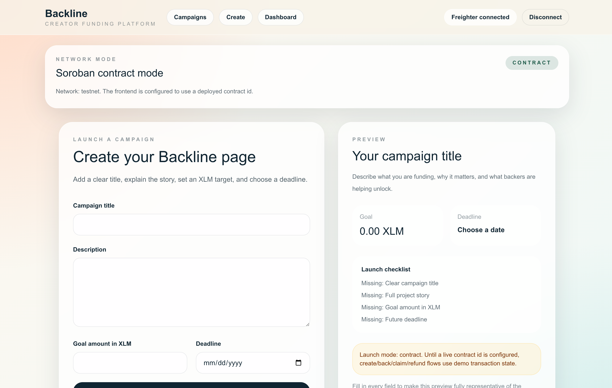
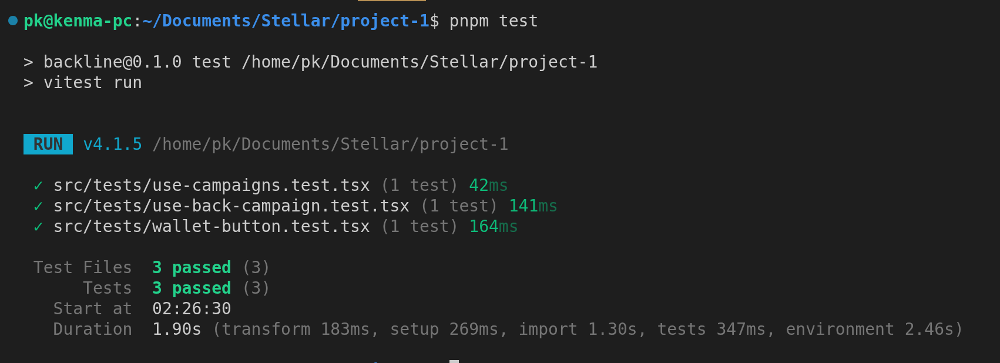

# Backline

Backline is a crowdfunding platform built on Stellar with a Next.js frontend and a Soroban smart contract. Creators can launch campaigns with funding goals and deadlines, supporters can back them with XLM, and campaigns follow clear claim and refund rules after the deadline.

## Content

- [Overview](#overview)
- [Highlights](#highlights)
- [Live links](#live-links)
- [Live contract details](#live-contract-details)
- [Screenshots](#screenshots)
- [Features](#features)
- [Tech stack](#tech-stack)
- [Project structure](#project-structure)
- [Test status](#test-status)
- [Getting started](#getting-started)
- [Smart contract workflow](#smart-contract-workflow)
- [Product behavior](#product-behavior)

## Overview

- Product: `Backline`
- Category: crowdfunding dApp
- Network used today: Stellar testnet
- Frontend: Next.js, React, TypeScript, Tailwind CSS
- Smart contract: Soroban Rust contract
- Wallet support: Freighter

## Highlights

- Campaign creation with title, description, goal, and deadline
- Campaign browsing with filtering, sorting, progress tracking, and status grouping
- Campaign details with live backing, claim, and refund actions
- Freighter wallet connection and transaction signing
- Cached campaign and balance reads with React Query
- Toast-based transaction feedback for pending, success, and error states
- Creator dashboard with account-specific campaign activity
- Real Soroban contract deployment and live contract reads

## Live links

- Live website: [backline-web.vercel.app](https://backline-web.vercel.app)

- Demo video: [Watch on Youtube](https://youtu.be/jTLjVX4klvo)

- Contract on Stellar Lab:
  `https://lab.stellar.org/r/testnet/contract/CD3FVQNCYZW3WCHVQK2QFTDUX7SUP5RYPY2O5O5C375R3O466ZXWB4HX`
  
- Deploy transaction on Stellar Expert:
  `https://stellar.expert/explorer/testnet/tx/d9ee7961280a9ac8df7ec633e0534e108b47b29dbae542ee70697f80a4b50e19`

## Live contract details

- Contract ID:
  `CD3FVQNCYZW3WCHVQK2QFTDUX7SUP5RYPY2O5O5C375R3O466ZXWB4HX`

### Contract methods

- `get_campaign_count`
- `create_campaign`
- `back_campaign`
- `get_campaign`
- `get_total_raised`
- `get_backers_count`
- `get_backers`
- `claim_funds`
- `refund`

## Screenshots

### Hero Section


### Campaign Listing


### Detailed Campaign page


### Dashboard


### Create Campaign


### Test Cases Passed(3)


## Features

### Core product

- Home page focused on product marketing and featured campaigns
- Campaign listing page with active campaigns prioritized ahead of ended ones
- Campaign detail page with recent backers, contribution form, and campaign actions
- Creator dashboard with created campaigns, backed campaigns, claim queue, and refund queue
- Create campaign page with preview and draft persistence

### Wallet and transaction flow

- Freighter wallet connect and disconnect flow
- Signed Soroban transactions for:
  - `create_campaign`
  - `back_campaign`
  - `claim_funds`
  - `refund`
- Transaction hash feedback with Stellar Expert links
- Friendly toast errors for cancellation, missing wallet, and submission failures

### Contract-backed data

- Campaign list loaded from live contract storage
- Individual campaign details loaded from the deployed contract
- Backer counts and recent contribution data loaded from contract reads
- Polling-based refresh through React Query

## Tech stack

### Frontend

- Next.js `16.2.4`
- React `19.2.5`
- TypeScript `6.0.3`
- Tailwind CSS `4.2.4`
- `@tanstack/react-query`
- `@stellar/stellar-sdk`
- `@stellar/freighter-api`

### Smart contract

- Rust
- `soroban-sdk`

### Testing

- Vitest
- Testing Library

## Project structure

```text
.
├── contracts/
│   └── crowdfund/
│       ├── src/
│       └── Cargo.toml
├── src/
│   ├── app/
│   ├── components/
│   ├── hooks/
│   ├── lib/
│   ├── tests/
│   └── types/
├── .env.example
├── package.json
└── README.md
```


## Test status

Verified locally:

```bash
$ pnpm test

Test Files  3 passed (3)
Tests       3 passed (3)
```

Covered flows:

- Wallet connect and disconnect flow
- Campaign data fetching
- Backing transaction mutation flow

## Getting started

### Prerequisites

- Node.js `18+`
- `pnpm`
- Rust toolchain
- `wasm32v1-none` target
- Freighter browser extension

### Install

```bash
pnpm install
```

### Environment variables

Copy `.env.example` to `.env.local`:

```bash
NEXT_PUBLIC_NETWORK=testnet
NEXT_PUBLIC_CONTRACT_ID=CD3FVQNCYZW3WCHVQK2QFTDUX7SUP5RYPY2O5O5C375R3O466ZXWB4HX
NEXT_PUBLIC_SOROBAN_RPC_URL=https://soroban-testnet.stellar.org
NEXT_PUBLIC_HORIZON_URL=https://horizon-testnet.stellar.org
NEXT_PUBLIC_STELLAR_EXPERT_URL=https://stellar.expert/explorer/testnet
```

### Run the app

```bash
pnpm dev
```

### Run frontend tests

```bash
pnpm test
```

### Type check

```bash
pnpm exec tsc --noEmit
```

## Smart contract workflow

### Run contract tests

```bash
pnpm contract:test
```

### Build the contract

```bash
pnpm contract:build
```

### Manual deploy command

```bash
stellar contract deploy \
  --wasm target/wasm32v1-none/release/backline_crowdfund.wasm \
  --source-account earnify-admin \
  --network testnet \
  --alias backline-testnet
```

## Product behavior

### Campaign lifecycle

1. A creator launches a campaign with a goal and deadline.
2. Backers contribute XLM by signing Soroban transactions with Freighter.
3. Active campaigns stay visible first in campaign listings.
4. If a campaign reaches its goal and the deadline passes, the creator can claim funds.
5. If a campaign misses its goal and the deadline passes, backers can request refunds.

### Data and caching

- Campaign data uses React Query caching
- Balance reads are cached and refreshed after mutations
- Campaign detail reads are refetched on an interval for near-live updates

